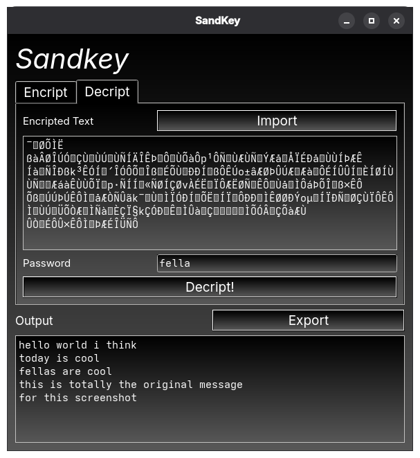

# SandKey

An extreamly simple encoding system

## GUI app

Should work on both desktop and mobile however I am unsure about TV

### Install
`curl https://raw.githubusercontent.com/ActuallySandPotNoodles/sandkey/refs/heads/main/install.sh | sudo bash`

It's that easy (once again)

## Python Usage

`import sandkey`

### Encript somthing
`sandkey.encode(Your data, password)`

- If the password is left blank ("") a key will randomly be generated and printed to the terminal

### Decode Somthing
`sandkey.decode(Encripted data, password)`

- This time the password is required
- <s>You may end up with an error with chr() caused by getting the password wrong and it trying to shift to bellow 0 (causing an error)</s> //fixed it

### Planning to add
`sandkey.xor(Your data, Password)`

- Since I was told that I could do this apparently
